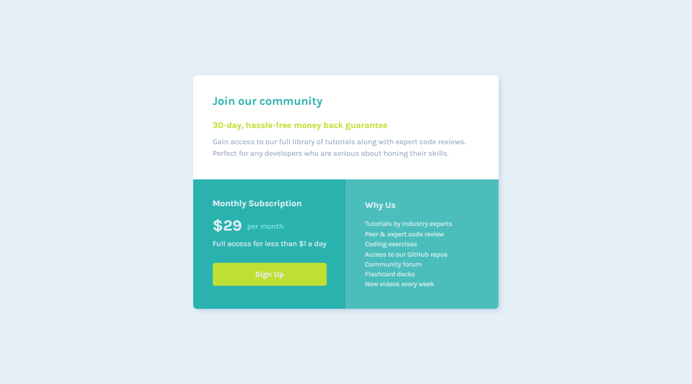

<h1 align="center">Single price grid component</h1>

[Live](https://damuzid.github.io/single-price-grid-component/)
| [Solution](https://damuzid.github.io/single-price-grid-component/)
| [Challenge](https://www.frontendmentor.io/challenges/single-price-grid-component-5ce41129d0ff452fec5abbbc)

Solution for a challenge from [frontendmentor.io](https://www.frontendmentor.io/)

## About The Project

In this challenge, you will build out the pricing component to the designs provided. This is perfect for beginners and people who want to complete a smaller challenge. Your challenge is to build out this pricing component and get it looking as close to the design as possible. You can use any tools you like to help you complete the challenge. So if you've got something you'd like to practice, feel free to give it a go.

The optimal layout depending on the used device's screen size should be shown.

*This challenge was completed without access to the Figma design file.*

## Built with 

- Semantic HTML5 markup
- CSS custom properties
- CSS Grid
- Desktop-first workflow
- Media query's

## What I learned

This was a fun albeit easy challenge and a first time using a CSS grid for me. So I learned alot about the different properties when using a grid and it's columns and rows.

## Useful resources

1. [Perfect Pixel](https://chrome.google.com/webstore/detail/perfectpixel-by-welldonec/dkaagdgjmgdmbnecmcefdhjekcoceebi) - Great Chrome(also available for other browsers) extension that helps to match the pixels of a design image.
3. [Debug CSS](https://chrome.google.com/webstore/detail/debug-css/igiofjnckcagmjgdoaakafngegecjnkj) - Another great Chrome(and other browsers) extension for a quick view of all your elements by outlining them.  
2. [MDN Web Docs](https://developer.mozilla.org/en-US/) - The Mozilla Web Docs are a treasure trove of infromation on CSS and more.
